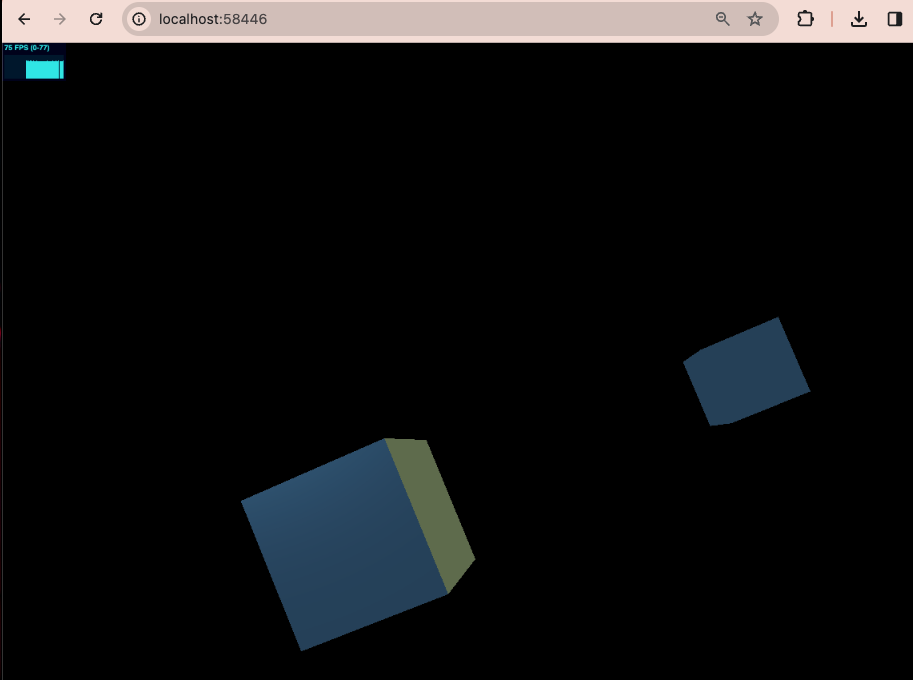

# Three.js Playground

## Intro
This is a repo for experimenting with Three.js. 
Three.js is a powerful JavasScript library for rendering 3D graphics in the browser.
The focus of this project is to understand the basics of 3D modeling, lighting and animation
using WebGL through Three.js.

# Running the project
To run this project locally, follow the [Three.js installation guide](https://threejs.org/docs/#manual/en/introduction/Installation).

Make sure that you run these commands in whichever folder you are putting your html, js and css files:

```bash
npm install --save three
npm install --save-dev vite
```
This will install three.js and a build tool Vite in your project folder.

Now start your server using 

```bash
npx serve .
```

Go to http://localhost:58446 (or whichever port your service is in) and
this is what you will see in the browser (for the twoCubes demo):


You can move around the scene using Fly Controls:

| Key      | Description |
| ----------- | ----------- |
| WASD        | Move        |
| R | F       | Up/Down     |
| Q | E       | Roll        |
| up | down   | Pitch       |
| left | right  | Yaw       |